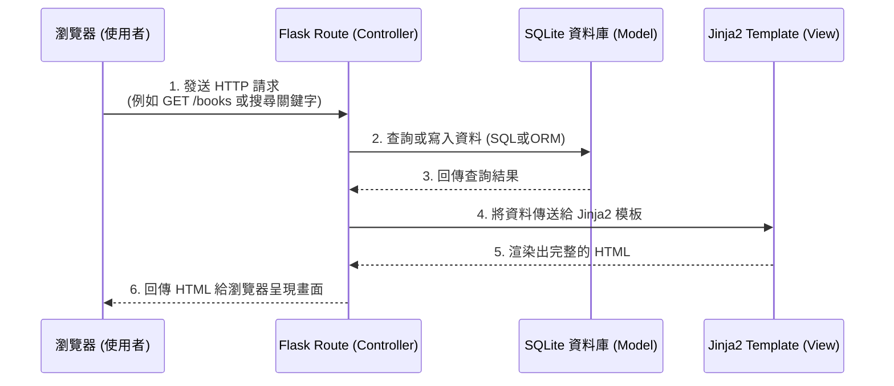

# 讀書筆記本 - 系統架構文件 (Architecture)

## 1. 技術架構說明

本系統採用的技術堆疊如下：

- **後端框架：Python + Flask**
  輕量級且易於上手的 Python 網頁框架，適合用來快速打造具備核心功能的讀書筆記本 MVP。
- **模板引擎：Jinja2**
  與 Flask 完美整合的模板引擎。我們將採用傳統伺服器渲染 (Server-Side Rendering) 模式，由 Jinja2 負責將後端取得的資料動態渲染成 HTML 頁面。
- **資料庫：SQLite**
  輕量級、免安裝獨立伺服器的關聯式資料庫系統。適合做為 MVP 專案的資料儲存中心（儲存書籍資訊、心得與標籤狀態）。

**Flask MVC 模式說明：**
儘管 Flask 本身是微框架，但我們將依循類似 **MVC (Model-View-Controller)** 的概念來組織專案結構。
- **Model (模型)**：負責定義資料表結構並與 SQLite 資料庫互動（例如進行書籍與心得的 CRUD 增刪查改）。
- **View (視圖)**：負責前端呈現介面。也就是交由 Jinja2 解析與渲染的 HTML 模板，以及輔助的 CSS/JS 靜態檔。
- **Controller (控制器)**：在 Flask 裡負責「路由 (Routes)」。用來接收瀏覽器的 HTTP 請求、處理商業邏輯、呼叫 Model ，然後將資料拋給 View (Jinja2) 生成最終網頁。

## 2. 專案資料夾結構

為了讓專案清晰好維護，以下是預期建立的資料夾組織方式：

```text
web_app_development/
├── app/                  # 應用程式主目錄
│   ├── __init__.py       # 初始化 Flask App 
│   ├── models/           # (Model) 資料庫模型與資料存取邏輯
│   │   └── database.py   # 定義書籍、心得、分類/標籤等資料表
│   ├── routes/           # (Controller) Flask 路由
│   │   ├── book_routes.py# 負責書籍清單、新增、搜尋等路由
│   │   └── note_routes.py# 負責撰寫筆記與評分的路由
│   ├── templates/        # (View) Jinja2 HTML 模板
│   │   ├── base.html     # 共用版型（導覽列、頁尾）
│   │   ├── index.html    # 首頁（搜尋與推薦列表）
│   │   ├── book_list.html# 所有書籍與心得清單
│   │   └── book_add.html # 新增書籍/填寫心得表單
│   └── static/           # CSS、JS 與圖片等靜態資源
│       ├── css/          # 樣式表（建議採用 vanilla CSS 或自訂樣式）
│       └── js/           # 前端互動邏輯
├── instance/             # 獨立儲存應用程式設定與資料（不進版本控制）
│   └── database.db       # SQLite 資料庫檔案
├── docs/                 # 專案文件
│   ├── PRD.md            # 產品需求文件
│   └── ARCHITECTURE.md   # 系統架構文件
├── app.py                # 應用程式入口點，負責啟動伺服器
└── requirements.txt      # 記錄套件依賴 (如 Flask)
```

## 3. 元件關係圖

以下展示了使用者在瀏覽器中發出請求後，系統內部各個元件是如何互動的：



## 4. 關鍵設計決策

1. **不採用前後端分離，使用 SSR (Server-Side Rendering)**
   - **原因**：對於讀書筆記本的初始版本而言，功能著重於簡單的表單提交與資料呈現。使用 Flask + Jinja2 統一產出 HTML，可大幅降低初期開發與部署時間，降低跨來源資源共用 (CORS) 與 API 管理成本。
2. **採用 SQLite 作為資料庫**
   - **原因**：SQLite 不需配置獨立資料庫伺服器服務，資料皆儲存於單一檔案中，適合學校圖書館等輕量應用場景，管理與備份皆十分單純。
3. **依據功能模組化 Routes**
   - **原因**：將路由分拆為 `book_routes.py` 和 `note_routes.py` 等模組而不到處寫在單一 `app.py` 中，可以維持 Controller 的簡潔，並有利後續因應更多功能（如排行榜）而輕鬆擴充。
4. **客製化樣式與美學優先**
   - **原因**：提供優秀的數位體驗能強化使用意願。我們將以 Vanilla CSS（或輕量級 CSS 框架）實作流暢動畫、現代化字體，為使用者打造質感優異的預覽與互動體驗。
