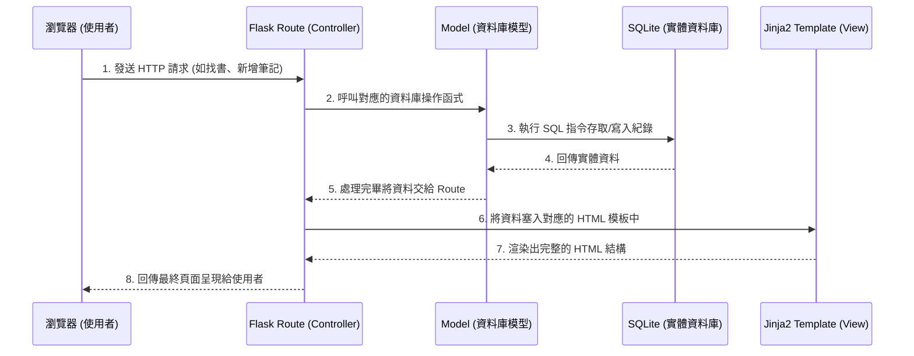

# 讀書筆記本 - 系統架構文件 (Architecture)

## 1. 技術架構說明

為了快速開發且符合專案的輕量級需求，本系統決定採用 **Flask** 框架來處理後端邏輯，並直接搭配 **Jinja2** 以及 **SQLite** 來構築網頁應用，不採用複雜的前後端分離架構。

### 選用技術與原因：
- **後端：Python + Flask**
  - 原因：Flask 是一個輕量級的 Web 框架，學習曲線平緩，非常適合用來快速打造 MVP (Minimum Viable Product)。
- **模板引擎：Jinja2**
  - 原因：內建於 Flask 中，可以直接將後端資料無縫渲染成 HTML 呈現給使用者，不需要額外維護一套前端框架與 API，降低初期開發門檻。
- **資料庫：SQLite (搭配 SQLAlchemy 或 sqlite3)**
  - 原因：只需一個單一檔案即可儲存結構化資料，無需額外安裝或維護資料庫伺服器，非常適合中小型專案以及開發階段使用。

### Flask MVC 模式說明：
在本專案中，我們會參考 MVC (Model-View-Controller) 的設計模式來組織程式碼：
- **Model (模型)**：負責處理資料邏輯以及資料表結構設計。我們會定義如「書籍(Book)」或「筆記(Note)」的資料庫模型與邏輯。
- **View (視圖)**：負責將資料轉換為使用者看到的畫面。這裡是透過 **Jinja2** 模板引擎來渲染從後端傳來的資料，並套用 HTML 與 CSS 樣式。
- **Controller (控制器)**：由 **Flask 的路由 (Routes)** 負責，接收使用者從瀏覽器發送的請求 (Requests) 後，呼叫相關的 Model 取得或修改資料，最後將資料傳遞給 View 進行頁面渲染並回傳。

---

## 2. 專案資料夾結構

良好的資料夾結構可以幫助我們更容易維護與擴充程式碼。以下是為本專案建議的結構設計：

```text
/ (專案根目錄)
├── app/                  # 主要的應用程式邏輯目錄
│   ├── __init__.py       # Flask App 的初始化與設定檔案 (可搭配 Blueprint)
│   ├── models/           # (Model) 資料庫模型資料夾
│   │   └── book.py       # 定義如書籍、筆記、標籤的 Schema 和資料庫操作
│   ├── routes/           # (Controller) 路由控制器資料夾
│   │   ├── main.py       # 定義首頁、搜尋等主要通用頁面的路由
│   │   └── notes.py      # 處理新增書籍、寫心得、評分等詳細功能的路由
│   ├── templates/        # (View) Jinja2 HTML 模板
│   │   ├── base.html     # 所有頁面共用的基礎佈局 (包含上方 Navbar)
│   │   ├── index.html    # 首頁與書籍列表
│   │   ├── form.html     # 新增/編輯心得與評分的表單頁面
│   │   └── search.html   # 搜尋結果頁面
│   └── static/           # 前端靜態資源
│       ├── css/          # 樣式表檔案
│       ├── js/           # 客製化 JavaScript (如輕量互動)
│       └── images/       # 圖片檔案 (如預設書本封面等)
├── instance/             # 存放敏感或執行時產生的檔案
│   └── database.db       # SQLite 資料庫實體檔案 (此目錄通常寫入 .gitignore)
├── docs/                 # 專案相關文件
│   ├── PRD.md            # 產品需求文件
│   └── ARCHITECTURE.md   # 系統架構文件
├── requirements.txt      # Python 依賴套件清單 (如 Flask)
└── app.py                # 整個專案的入口處，用於啟動 Flask 伺服器
```

---

## 3. 元件關係圖

以下圖表說明了當使用者透過瀏覽器操作「讀書筆記本」時，系統內部元件如何交流：



---

## 4. 關鍵設計決策

以下列出專案中幾項重要的設計選擇及原因：

1. **一體化渲染 (Server-side Rendering) 取代 前後端分離**
   - **原因**：為了加速 MVP 版本的開發與測試，並符合現有技術限制，直接使用 Jinja2 作為後端渲染引擎。這避免了過早需要維護 API 文件與處理跨域 (CORS) 存取的問題，保持架構單純。
2. **資料庫本地化 (SQLite 搭配 instance 目錄)**
   - **原因**：讀書筆記本在第一階段主要針對校園學生的輕量應用，考量到無需處理極高併發的情境，而且需要極簡的環境建置體驗。將 `.db` 檔案存放在 `instance/` 資料夾並忽略版控，既能保護資料，又能省去架設外部資料庫伺服器的繁瑣。
3. **根據功能拆分路由結構 (Routes 分別管理)**
   - **原因**：雖然初期的功能只有紀錄、心得與搜尋，但如果將所有路由都寫在 `app.py` 中，很快就會變得難以維護。因此，提早將功能路由分離到 `routes/` 下的多個檔案，能夠提升程式碼的易讀性，為將來的「熱門排行榜」等延伸功能做足準備。
4. **採用 MVC 設計模式思維劃分檔案結構**
   - **原因**：強制將負責資料邏輯 (models)、頁面處理控制 (routes) 和前端畫面 (templates) 拉開，讓每個檔案「責任單一」，之後如果需要針對排版(View)或資料庫(Model)修改時，可以非常快速的定位問題所在。
