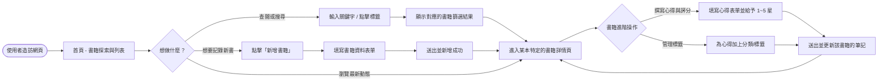
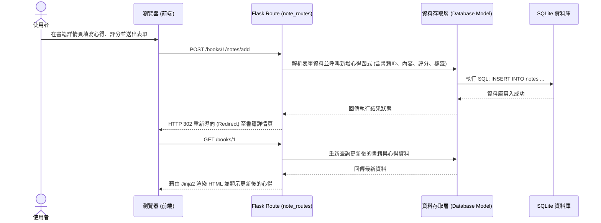

# 讀書筆記本 - 流程圖與對照表 (Flowchart)

根據 PRD 的產品需求與系統架構設計，以下整理出使用者的操作路徑（User Flow）、新增資料的系統資料流（Sequence Diagram），以及對應的路由端點設計。

## 1. 使用者流程圖（User Flow）

描述使用者從進入「讀書筆記本」網站開始，可能會經歷的各項核心操作路徑：

## 2. 系統序列圖（Sequence Diagram）

以下示範當使用者執行 **「撰寫心得與評分功能 (POST)」** 時，系統內部各元件的詳細互動與資料流：

## 3. 功能清單與路由對照表

將上述操作拆解為實際對應的 API 與頁面路由端點，作為後續 `api-design` 與 `implementation` 開發的基礎：

| 功能名稱 | 對應 URL 路徑 | HTTP 方法 | 負責Controller模組 | 說明 / 預期處理行為 |
|----------|---------------|-----------|--------------------|---------------------|
| 首頁 / 所有書籍列表 | `/` 或 `/books` | GET | `book_routes.py` | 顯示系統中所有已登記的書籍與最新動態。 |
| 搜尋書籍 | `/books/search` | GET | `book_routes.py` | 透過查詢字串(Query String)如 `?q=關鍵字` 篩選書籍。 |
| 新增書籍頁面 (表單) | `/books/add` | GET | `book_routes.py` | 回傳新增書籍的 HTML 表單頁面。 |
| 寫入書籍資料 | `/books/add` | POST | `book_routes.py` | 接收表單 Payload 並寫入資料庫，完成後重導向。 |
| 書籍詳情與心得列表 | `/books/<int:id>` | GET | `book_routes.py` | 顯示特定書籍的詳細資料、歷來所有心得與星階評分。 |
| 撰寫心得表單頁面 | `/books/<int:id>/notes/add`| GET | `note_routes.py` | 針對特定書籍，回傳新增閱讀心得的表單頁面。 |
| 寫入心得與評分 | `/books/<int:id>/notes/add`| POST| `note_routes.py` | 接收心得內容、評分、加上標籤，成功後重導向回書籍頁。 |
| 依標籤探索筆記 | `/tags/<string:tag_name>` | GET | `note_routes.py` | 列出包含特定標籤/分類的所有書籍紀錄與心得。 |
